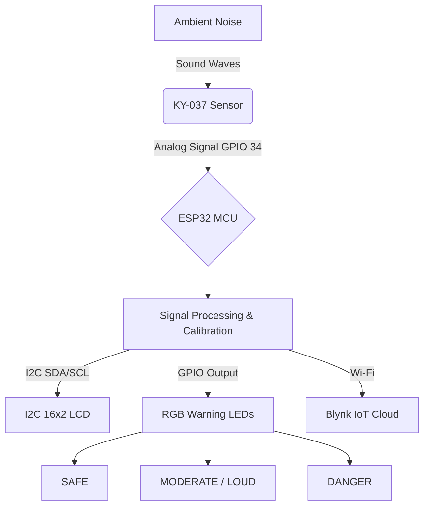

#  IoT Smart Noise Pollution Monitor

### ESP32 + KY-037 + Blynk IoT Cloud

An advanced **IoT-based real-time Environmental Noise Monitoring System** built using an **ESP32 NodeMCU**, **KY-037 High-Sensitivity Sound Sensor**, **I2C 16x2 LCD Display**, and **Blynk IoT Cloud**.

This system continuously monitors ambient noise intensity, converts acoustic signals into calibrated decibel values, classifies noise levels into safety zones, provides local visual warnings, and streams live telemetry data to the cloud through Wi-Fi.

---

#  Features

##  Real-Time Noise Measurement

* Reads analog acoustic signals from the KY-037 sensor using the ESP32's **12-bit ADC (0–4095)**.
* Converts processed sensor values into estimated noise levels:

```
30 dB - 120 dB
```

* Uses averaging and calibration algorithms for stable readings.

---

##  Signal Inversion & Calibration

The KY-037 analog output produces an inverted signal response. The firmware applies mathematical correction:

### Acoustic Signal Inversion

[
\text{Inverted Raw} = 4095.0 - \text{Average}
]

### Linear Decibel Calibration

[
dB =
\left(
\frac{
(\text{Inverted Raw}-500.0)
\times
(DB_{MAX}-DB_{MIN})
}
{3500.0-500.0}
\right)

* DB_{MIN}
  ]

Where:

```
DB_MIN = 30 dB
DB_MAX = 120 dB
```

The final output is constrained within the calibrated range.

---

#  Noise Classification System

| Noise Level | Status          | Indicator     |
| ----------- | --------------- | ------------- |
| < 35 dB     | SAFE            | 🟢 Green LED  |
| 35–54 dB    | MODERATE / LOUD | 🟡 Yellow LED |
| ≥ 55 dB     | DANGER          | 🔴 Red LED    |

---

#  Local Display System

The system displays:

```
Noise: XX dB
Status: SAFE
```

on an **I2C 16x2 LCD display**.

---

#  IoT Cloud Monitoring

The project uses **Blynk IoT Cloud** for remote monitoring.

Features:

* Real-time decibel monitoring.
* Status monitoring.
* Wireless data transmission through Wi-Fi.

### Blynk Virtual Pins

| Virtual Pin | Data Type | Description      |
| ----------- | --------- | ---------------- |
| V0          | Integer   | Noise Level (dB) |
| V1          | String    | Safety Status    |

---

#  System Architecture



---

#  Hardware Wiring

| Component  | Component Pin | ESP32 Pin                 | Description        |
| ---------- | ------------- | ------------------------- | ------------------ |
| KY-037     | A0 Analog Out | GPIO 34                   | Sound Signal Input |
| KY-037     | VCC           | 3.3V / VIN                | Power              |
| KY-037     | GND           | GND                       | Ground             |
| LCD I2C    | SDA           | GPIO 21                   | I2C Data           |
| LCD I2C    | SCL           | GPIO 22                   | I2C Clock          |
| LCD I2C    | VCC           | 5V / VIN                  | Power              |
| LCD I2C    | GND           | GND                       | Ground             |
| Green LED  | Anode (+)     | GPIO 25                   | Safe Indicator     |
| Yellow LED | Anode (+)     | GPIO 26                   | Warning Indicator  |
| Red LED    | Anode (+)     | GPIO 27                   | Danger Indicator   |
| LEDs       | Cathode (-)   | GND through 220Ω resistor | Current Limiting   |

---

#  Required Hardware

* ESP32 NodeMCU Development Board
* KY-037 High Sensitivity Sound Sensor
* 16x2 I2C LCD Display
* Green LED
* Yellow LED
* Red LED
* 220Ω resistors
* Breadboard
* Jumper wires
* Wi-Fi connection

---

#  Software Requirements

## Arduino IDE Libraries

Install the following libraries:

### Required Libraries

* **Blynk**
* **hd44780 by Bill Perry**
* ESP32 Board Package

---

#  Installation Guide

## 1. Clone Repository

```bash
git clone https://github.com/yourusername/IoT-Noise-Pollution-Monitor.git
```

---

## 2. Configure Wi-Fi

Open the Arduino sketch and update:

```cpp
char ssid[] = "YOUR_WIFI_NAME";
char pass[] = "YOUR_WIFI_PASSWORD";
```

---

## 3. Configure Blynk

Create a Blynk template and update:

```cpp
#define BLYNK_TEMPLATE_ID "YOUR_TEMPLATE_ID"
#define BLYNK_TEMPLATE_NAME "YOUR_TEMPLATE_NAME"
#define BLYNK_AUTH_TOKEN "YOUR_AUTH_TOKEN"
```

---

## 4. Upload Firmware

1. Connect ESP32 through USB.
2. Select the correct ESP32 board.
3. Select the correct COM port.
4. Upload the program.

---

# ⏱️ Performance Design

The project uses:

### BlynkTimer

Instead of blocking delays:

```cpp
delay()
```

the system uses:

```cpp
BlynkTimer
```

Benefits:

* Faster response time.
* Smooth LCD updates.
* Reliable cloud communication.
* Non-blocking operation.

---

#  Project Structure

```
IoT-Noise-Pollution-Monitor/

│
├── NoiseMonitor.ino
├── README.md
│
└── images/
    ├── circuit.jpg
    ├── lcd_display.jpg
    └── blynk_dashboard.jpg
```

---

#  Important Note

The KY-037 is a low-cost sound detection module. The displayed decibel values are **calibrated estimates**, not laboratory-grade SPL measurements.

For professional sound level measurement, consider:

* MAX9814 microphone amplifier
* MAX4466 microphone module
* INMP441 I2S MEMS microphone

---

#  Contributors

Developed collaboratively as a hands-on embedded IoT engineering project.

### Team Members

**Amila Keranda**

* Lead Firmware Development
* Signal Calibration
* ESP32 Programming

**Partner**

* Circuit Integration
* Hardware Testing
* Quality Assurance

---

#  Contribution

Contributions are welcome!

You can:

* Report bugs.
* Suggest improvements.
* Submit pull requests.
* Improve calibration algorithms.

---

 If you find this project useful, consider giving it a star!
